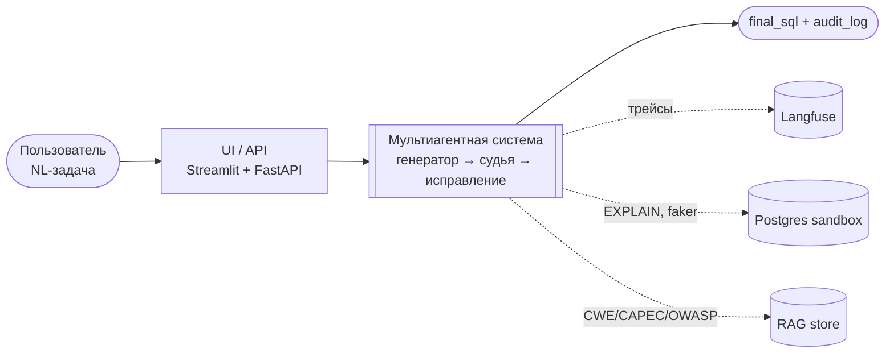
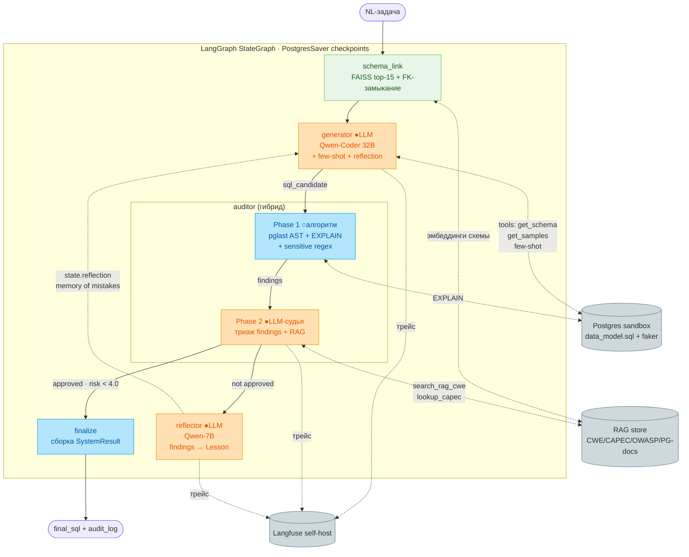
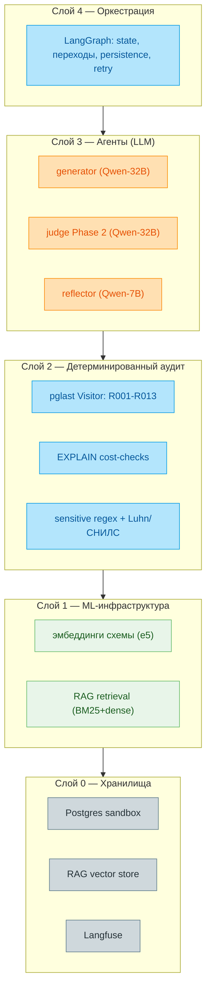

# Архитектура GreenData SQL Security System

> Картинка: [architecture.png](architecture.png) (рендер из [architecture.dot](architecture.dot) через `dot -Tpng`).
> Ниже — Mermaid-версии, которые рендерятся прямо в GitHub/IDE.

## Условные обозначения

| Цвет | Что значит |
|---|---|
| 🟦 голубой | детерминированный код (алгоритмы, без LLM) |
| 🟧 оранжевый | LLM-вызов |
| 🟩 зелёный | ML-эмбеддинги (не LLM) |
| ⬜ серый | инфраструктура / хранилище |

---

## 1. Высокоуровневый поток

---

## 2. Детальный граф (LangGraph)

---

## 3. Слои: что детерминированно, что LLM

---

## 4. Зоны ответственности команды (4 роли)

```mermaid
flowchart LR
    subgraph DATA["🗄️ Данные"]
        d1["schema_catalog.json"]
        d2["Postgres sandbox + faker"]
        d3["dataset_v1.jsonl"]
    end
    subgraph TOOLS["🔧 Тулы"]
        t1["pglast правила R001-R013"]
        t2["RAG-сборка CWE/CAPEC"]
        t3["plpgsql_check"]
    end
    subgraph LLM["🤖 LLM-инженер"]
        m1["LLMClient"]
        m2["generator / judge / reflector"]
        m3["LangGraph граф"]
    end
    subgraph ANALYST["📊 Аналитик"]
        a1["eval-pipeline (EX, Recall)"]
        a2["Langfuse + A/B"]
        a3["отчёт + презентация"]
    end

    DATA --> TOOLS
    DATA --> LLM
    TOOLS --> LLM
    LLM --> ANALYST
```

Подробности по ролям — будет в `docs/team_roles.md`.

---

## Контракты на стыках

| Стык | Контракт |
|---|---|
| UI → граф | `task: str → SystemResult` (`baseline1.py`) |
| generator → auditor | `sql: str + db_schema_meta` |
| Phase 1 → Phase 2 | `findings: list[Finding]` |
| auditor → reflector | `AuditResult` |
| reflector → generator | `state.reflection: list[Lesson]` |
| LLM-узлы → провайдер | OpenAI-compat `chat/completions` |
| RAG-tool → store | `search(query, top_k, filters) → list[Chunk]` |

Архитектурные обоснования — в [adr/](adr/).
