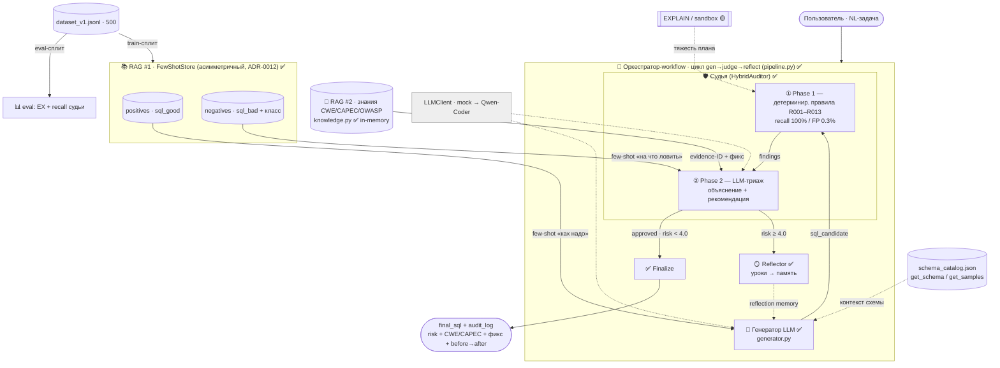

# Архитектура решения — мультиагент «генератор + судья» с двумя RAG

> Рабочая схема под кейс GreenData. Что реализовано (✅), что заглушка/частично
> (🟡), что план. Привязка к ADR — в [docs/adr/](adr/).

## Идея в одном абзаце

Workflow-оркестратор гоняет цикл **генератор → судья → reflector** до одобрения
(risk < 4.0) или лимита итераций. Судья **гибридный**: детерминированные правила
(Phase 1, recall 100% по 10 классам) + LLM-триаж (Phase 2). Две **асимметричные
RAG-плоскости**: (1) few-shot примеры из датасета — позитивы генератору, негативы
судье; (2) knowledge-RAG CWE/CAPEC/OWASP — судье для обоснования вердикта.

## Статус компонентов

| Компонент | Файл | Статус |
|---|---|---|
| Оркестратор-цикл (workflow) | [pipeline.py](../src/case3/pipeline.py) | ✅ Python-loop (LangGraph — план, ADR-0002) |
| 🤖 Генератор (+ positive few-shot) | [nodes/generator.py](../src/case3/nodes/generator.py) | ✅ |
| 🛡️ Судья Phase 1 (правила R001–R013) | [nodes/auditor.py](../src/case3/nodes/auditor.py) | ✅ recall 100% / FP 0.3% |
| 🛡️ Судья Phase 2 (LLM-триаж + negative few-shot) | nodes/auditor.py | ✅ |
| 🪞 Reflector (уроки в память) | [nodes/reflector.py](../src/case3/nodes/reflector.py) | ✅ |
| **RAG #1 — few-shot (асимметричный)** | [retrieval/fewshot.py](../src/case3/retrieval/fewshot.py) | ✅ 240 pos / 165 neg, lexical (e5+FAISS — прод) |
| **RAG #2 — знания CWE/CAPEC/OWASP** | [audit/knowledge.py](../src/case3/audit/knowledge.py) | ✅ in-memory (Qdrant+e5 — прод, ADR-0005) |
| Детектор PII/sensitive | [audit/sensitive.py](../src/case3/audit/sensitive.py) | ✅ regex + Luhn/СНИЛС |
| Тул EXPLAIN / sandbox-Postgres | [infra/db.py](../src/case3/infra/db.py) | 🟡 заглушка |
| LLM-клиент (mock → Qwen-Coder) | [llm/client.py](../src/case3/llm/client.py) | ✅ контракт; 🟡 реальный провайдер не подключён |
| Датасет 500 (300 safe / 200 vuln) | [dataset/generate_dataset.py](../dataset/generate_dataset.py) | ✅ |
| Схема-каталог (get_schema/samples) | data/schema_catalog.json | ✅ |

## Схема

## Контур безопасности (почему гибрид, а не голый LLM)

1. **Stage 0 — детерминированные правила** (Phase 1): независимы от генератора, дают высокий recall на структурных классах. На нашем датасете — 100% recall, 0.3% FP.
2. **RAG #1 (негативы)** + **Stage 1 LLM-триаж**: обогащает объяснение known-bad примерами нужных классов.
3. **RAG #2 (знания)**: подставляет верифицируемые CWE/CAPEC/OWASP и фикс → «прозрачность», без галлюцинаций.
4. **Reflector**: уроки в память генератора → на следующей итерации он не повторяет ошибку (in-context, без дообучения).

## Что планово (не на хакатон-MVP)

- **LangGraph + PostgresSaver** вместо Python-loop (ADR-0002) — когда цикл стабилизируется.
- **Реальный LLM** (Qwen-Coder через OpenRouter/vLLM) вместо mock — для боевого EX.
- **EXPLAIN/sandbox-Postgres** (ADR-0004) — оценка тяжести плана на реальных данных.
- **Векторные RAG** (Qdrant + e5) вместо in-memory/lexical (ADR-0003/0005) — оба плана RAG.
- **Ансамбль gen/judge** (bagging/boosting) — ADR-0012, трек ВКР, не на хакатон.
